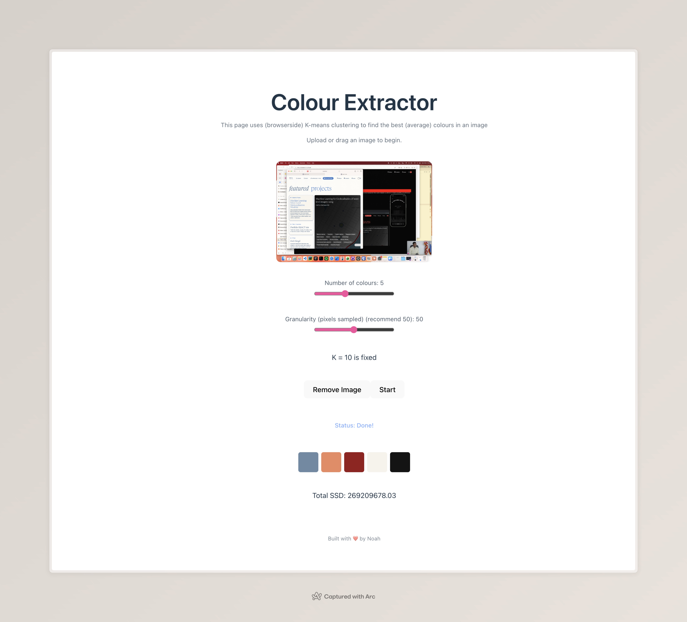

# Colour Extractor 🌈

Hey there! This is a fun little browser-based tool I built that extracts the main colours from most image types. Perfect for design inspiration, playful experiments, or just seeing what vibes your photos give off. All it does is Image > K means > Average of clusters.

K is fixed @ 10, but you can alter the arg to the helper in /src/colourextract/colourhelper.js
Granularity is every nth pixel that is sampled. There's no math just use 50 and you'll probably be fine.

**Github pages link live:** [https://2of.github.io/Colour-Extractor-Image-Web/](https://2of.github.io/Colour-Extractor-Image-Web/)

## How it works

1. **Upload or drag & drop an image** — any photo works.
2. **Pick the number of colours** you want to extract. More colours = more detailed palette.
3. **Adjust granularity** (pixels sampled) if you want a faster or more precise extraction.
4. **Click Start** — the site will process the image and show:
   - Your extracted palette of colours
   - The total SSD / inertia (a measure of how “tight” the clusters are, there's no real scale and the numbers are big and scary because it's just rgb space)
5. **Click any colour** to copy its hex code to your clipboard.

## Behind the scenes

This uses a **tiny K-means clustering implementation** running entirely in your browser. Basically, K-means tries to find `k` representative colours by grouping pixels that look similar — those groups’ average colours become your palette.  

- **SSD / inertia** is just the total squared distance of each pixel to its assigned cluster — lower means the colours fit the image better.  

## Tech stack

- React + Vite
- Pure JS K-means clustering
- SCSS for styling
- GitHub Pages for hosting

